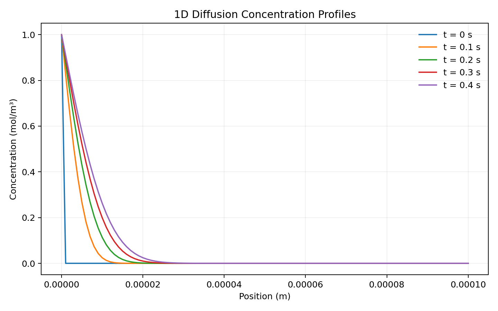
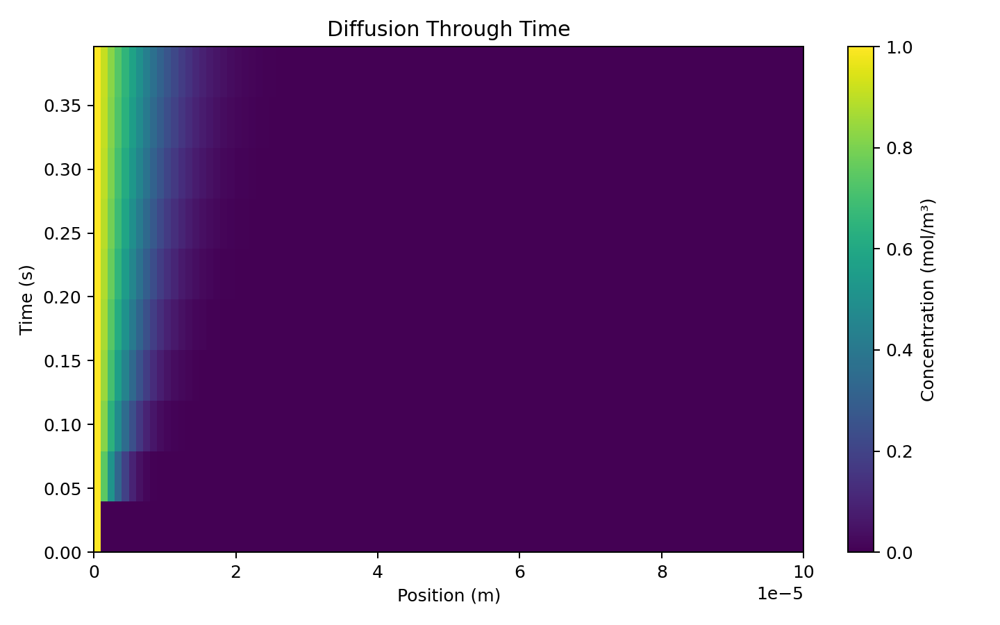

# 1D Fick's Law Diffusion Simulator

A Python simulation of one-dimensional diffusion using Fick's second law and an explicit finite-difference method.

I originally made this project to get more practice using Python for materials science problems. The program takes material and simulation parameters from the user, checks whether the chosen time and spatial steps are numerically stable, and then tracks how the concentration profile changes with time.



## Model

For constant diffusivity, the simulation solves Fick's second law:

```math
\frac{\partial C}{\partial t}
=
D\frac{\partial^2 C}{\partial x^2}
```

The second derivative is approximated using a centered finite difference:

```math
\frac{\partial^2 C}{\partial x^2}
\approx
\frac{C_{i+1}-2C_i+C_{i-1}}{\Delta x^2}
```

which gives the update used in the simulation:

```math
C_i^{n+1}
=
C_i^n
+
D\Delta t
\frac{C_{i+1}^n-2C_i^n+C_{i-1}^n}{\Delta x^2}
```

Because the solver is explicit, the program checks the stability condition

```math
\frac{D\Delta t}{\Delta x^2} \leq 0.5
```

before running.

## What it does

The original simulation uses a fixed surface concentration and tracks diffusion into a material. I later added a few other ways to run and analyze the model:

- fixed-surface diffusion
- finite-source diffusion
- interdiffusion from an initial concentration step
- automatic stability checking
- concentration profile and heatmap plots
- CSV output for concentration and flux data
- optional animation of concentration changing through the material

The animation uses a black-to-red bar to represent low-to-high concentration.



## Running the project

Install the dependencies:

```bash
pip install -r requirements.txt
```

For the original interactive version:

```bash
python main.py
```

The program will ask for:

- material length
- initial concentration
- surface concentration
- diffusion coefficient
- spatial step size
- time step size
- total simulation time

You can also run it directly from the command line. For example:

```bash
python main.py --mode fixed-surface --length 1e-4 --initial 0 --surface 1 --D 1e-10 --dx 1e-6 --time 0.4 --auto-dt
```

To open the animated concentration bar after the simulation:

```bash
python main.py --show-animation
```

Use `python main.py --help` to see the full set of options.

## Output

A run can save:

```text
concentration_profiles.csv
snapshots.csv
final_flux.csv
run_metadata.json
concentration_profiles.png
concentration_heatmap.png
```

The concentration data can be opened later in Python, MATLAB, or Excel for additional analysis.

## Files

```text
main.py
diffusion_functions.py
simulation.py
plots.py
data_utils.py
requirements.txt

assets/
    example_profiles.png
    example_heatmap.png

tests/
    test_diffusion.py

original/
    main.py
    diffusion_functions.py
    plots.py
```

`diffusion_functions.py` contains the finite-difference concentration update and stability check from the original version of the project. `simulation.py` handles the simulation loop and added boundary-condition modes, while `plots.py` contains the concentration animation and plotting functions.

## Notes

The current model assumes one-dimensional diffusion, constant diffusivity, uniform spatial spacing, and no reaction term. The interdiffusion mode also uses a single effective diffusion coefficient.

The main purpose of the project was to connect the diffusion equations from materials science with a numerical implementation and see how choices such as `dx`, `dt`, boundary conditions, and diffusivity affect the result.
